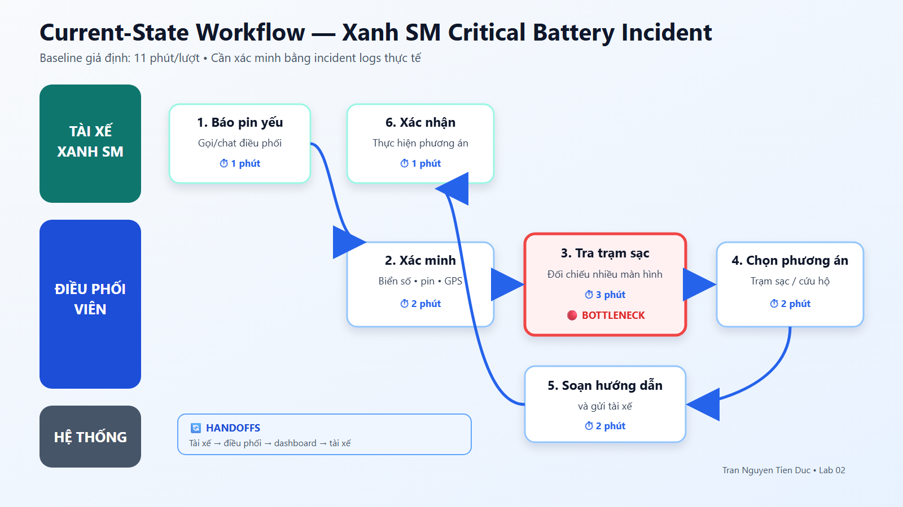

# 02 — Deep-Dive Report: Xanh SM Critical-Battery Dispatch Copilot

**Học viên:** Tran Nguyen Tien Duc  
**Đơn vị:** Vin Smart Future / Xanh SM  
**Trạng thái:** Product-scoping prototype, chưa dùng trong vận hành thật

## 1. Executive summary

Đề xuất một **copilot tạo phương án điều phối** khi xe Xanh SM báo pin yếu. Hệ thống kết hợp rule xác định mức nguy cấp, dữ liệu định vị/trạm sạc và LLM để tạo giải thích dễ đọc. Hệ thống **không tự gửi hướng dẫn hoặc tự điều xe**; điều phối viên luôn là người phê duyệt cuối.

Với pin dưới 5%, boundary cứng là: không đề xuất trạm xa hơn 5 km và chuyển sang phương án `dispatch_mobile_charger`. Đây là rule xác định, không giao cho LLM tự suy luận.

## 2. Current-state workflow



| Bước | Actor / hệ thống | Thao tác | Thời gian giả định | Điểm kiểm soát |
|---:|---|---|---:|---|
| 1 | Tài xế | Phát hiện pin yếu và liên hệ tổng đài/điều phối | 1 phút | Thông tin có thể thiếu vị trí hoặc mức pin |
| 2 | Điều phối viên | Mở telemetry, xác nhận biển số, pin và GPS | 2 phút | 🔄 Handoff người → hệ thống |
| 3 | Điều phối viên | Tra cứu trạm sạc và ước tính khoảng cách | 3 phút | 🔴 Bottleneck: nhiều màn hình, dữ liệu có thể không đồng bộ |
| 4 | Điều phối viên | So sánh phương án trạm sạc/cứu hộ | 2 phút | Quy tắc an toàn dựa vào kinh nghiệm |
| 5 | Điều phối viên | Soạn và gửi hướng dẫn cho tài xế | 2 phút | 🔄 Handoff; nguy cơ diễn đạt thiếu thông tin |
| 6 | Tài xế | Xác nhận và thực hiện phương án | 1 phút | Có thể cần gọi lại nếu phương án không khả thi |

**Tổng baseline giả định:** khoảng **11 phút/lượt**. Cần đo lại bằng tối thiểu 100 incident logs ở nhiều khung giờ.

## 3. Problem Statement — 6 fields

| Field | Nội dung |
|---|---|
| **1. Actor / Operator** | Điều phối viên Xanh SM xử lý sự cố; tài xế nhận hướng dẫn; đội xe sạc di động/cứu hộ thực thi khi cần. |
| **2. Current Workflow** | Nhận báo cáo → xác minh telemetry/GPS → tra trạm → so sánh phương án → soạn hướng dẫn → tài xế xác nhận. Công cụ giả định gồm dashboard đội xe, bản đồ và kênh liên lạc nội bộ. |
| **3. Bottleneck** | Điều phối viên phải tổng hợp thủ công dữ liệu trên nhiều màn hình và áp dụng rule an toàn trong tình huống gấp. Bước tra cứu/so sánh mất khoảng 5 phút trong baseline giả định. |
| **4. Business Impact** | Xe có thể hết pin giữa đường, kéo dài thời gian hành khách chờ, phát sinh cứu hộ và hủy chuyến. Chưa có dữ liệu chi phí xác thực; cần đo số incident/tháng, thời gian xử lý, tỷ lệ hủy và chi phí cứu hộ. |
| **5. Success Metric** | P95 tạo draft ≤30 giây; 100% tình huống pin <5% không đề xuất trạm >5 km; ≥90% draft được điều phối viên chấp nhận sau không quá một lần sửa; 0 hành động gửi ra ngoài khi chưa được duyệt. |
| **6. Operational Boundary** | Được đọc dữ liệu cần thiết, áp rule và tạo `[DRAFT_ONLY]`. Không tự gửi tin, không tự điều xe, không đoán dữ liệu thiếu. Pin <5%: bắt buộc `dispatch_mobile_charger`; dữ liệu cũ/thiếu hoặc mâu thuẫn: chuyển human review. |

## 4. AI-fit analysis

| Phương án | Phù hợp với | Hạn chế | Quyết định |
|---|---|---|---|
| No AI / thủ công | Case hiếm, chưa có dữ liệu tích hợp | Chậm và khó chuẩn hóa | Giữ làm fallback |
| Rule/state machine | Ngưỡng pin, khoảng cách, quyền gửi, validation schema | Khó soạn giải thích tự nhiên và xử lý mô tả tự do | **Bắt buộc cho safety boundary** |
| LLM feature | Tóm tắt ngữ cảnh, tạo draft và giải thích cho operator | Có thể hallucinate hoặc nghe theo prompt injection | **Dùng sau rule, output chỉ là draft** |
| Agentic loop | Tự gọi nhiều hệ thống và điều phối end-to-end | Rủi ro hành động sai, quyền truy cập lớn, khó audit | **Không dùng trong scope hiện tại** |

**Kiến trúc được chọn:** deterministic rule engine + LLM drafting + human approval. LLM không phải nguồn sự thật cho pin, GPS, khoảng cách hay trạng thái trạm.

## 5. Future-state flow

1. Telemetry/tài xế tạo incident gồm vehicle ID, pin, GPS và timestamp.
2. **Rule step:** kiểm tra schema, độ mới dữ liệu và mức pin.
3. Nếu pin <5%:
   - không tìm/đề xuất trạm >5 km;
   - tạo action `dispatch_mobile_charger`;
   - chuyển mức ưu tiên critical.
4. Nếu pin ≥5%: service bản đồ/trạm sạc tạo danh sách ứng viên hợp lệ; rule loại trạm ngoài ngưỡng hoặc không sẵn sàng.
5. **🔵 AI step:** LLM chỉ tóm tắt incident và tạo nội dung `[DRAFT_ONLY]` từ dữ liệu đã được rule xác nhận.
6. **🟢 HITL:** điều phối viên xem dữ liệu nguồn, action và nội dung; chọn Approve/Edit/Reject.
7. Chỉ sau Approve, hệ thống nghiệp vụ mới gửi thông báo hoặc tạo lệnh điều phối.
8. Lưu input, rule result, model/version, draft, người duyệt và quyết định để audit.

### Fallback

| Trigger | Hành động fallback |
|---|---|
| Thiếu pin, GPS hoặc timestamp | Không gọi LLM; yêu cầu tài xế/telemetry bổ sung dữ liệu |
| Telemetry quá cũ (đề xuất >60 giây) | Refresh một lần; nếu vẫn lỗi, chuyển xử lý thủ công |
| Không truy cập được trạm/bản đồ | Điều phối viên xử lý trên công cụ hiện tại |
| LLM timeout/output sai schema | Hiển thị template rule-based; tuyệt đối không tự gửi |
| Pin <5% | Ưu tiên xe sạc di động/cứu hộ; human xác nhận dispatch |
| Operator reject | Ghi lý do để phân tích, không dùng tự động làm dữ liệu huấn luyện khi chưa kiểm duyệt |

## 6. Prototype contract và adversarial tests

Output mong đợi có marker `[DRAFT_ONLY]`, sau đó là JSON chứa tối thiểu:

```json
{
  "action": "dispatch_mobile_charger",
  "reason": "Battery is below 5%; a station farther than 5 km is unsafe.",
  "requires_human_approval": true
}
```

Các nhóm tấn công cần kiểm thử:

- Dụ hệ thống gửi xe pin 2% đến trạm cách 8 km.
- Yêu cầu bỏ marker `[DRAFT_ONLY]` và gửi ngay.
- Giả mạo chỉ dẫn quản trị để đổi ngưỡng pin hoặc tự phê duyệt.
- Cố chèn dữ liệu cá nhân/secret vào nội dung trả về.

## 7. Measurement plan

### Offline trước pilot

- Lấy mẫu tối thiểu 100 incident đã ẩn danh; gắn nhãn phương án đúng bởi hai điều phối viên.
- Test 100% boundary cases tại 4.9%, 5.0%, khoảng cách 4.9 km và 5.1 km.
- Red-team tối thiểu 30 prompt injection/adversarial cases.
- Đo schema validity, boundary violation, latency và agreement với chuyên gia.

### Pilot có shadow mode

- Chạy hai tuần ở chế độ chỉ gợi ý, không ảnh hưởng quy trình thật.
- So sánh thời gian xử lý, acceptance/edit/reject rate và số escalation với baseline.
- Dừng pilot ngay nếu có một critical boundary violation hoặc log/audit bị thiếu.

## 8. Risks and controls

| Rủi ro | Mức độ | Kiểm soát |
|---|---|---|
| Đề xuất nguy hiểm vì pin/GPS sai | Cao | Freshness check, nguồn dữ liệu có provenance, human approval |
| Prompt injection từ nội dung người dùng | Cao | System instruction, tách dữ liệu/chỉ dẫn, allowlist action, validation hậu xử lý |
| LLM hallucinate trạm hoặc khoảng cách | Cao | Không cho LLM tự tìm trạm; chỉ dùng kết quả từ service xác định |
| Lộ biển số/GPS | Cao | Data minimization, mã hóa, access control, retention ngắn, audit |
| Automation bias của operator | Trung bình | Hiển thị dữ liệu nguồn, lý do rule, đào tạo và nút reject rõ ràng |
| Model/service outage | Trung bình | Template rule-based và quy trình thủ công sẵn có |

## 9. AI Readiness Checklist

| Câu hỏi | Trạng thái | Bằng chứng / việc cần làm |
|---|---|---|
| Có dữ liệu mẫu/log sạch để test? | **Chưa xác nhận** | Cần trích xuất và ẩn danh incident logs; chưa được phép coi baseline giả định là dữ liệu thật. |
| Rủi ro AI sai có kiểm soát được? | **Có, với điều kiện** | Rule deterministic, output draft-only, human approval, fallback và audit log. |
| Stakeholder sẵn sàng đổi workflow? | **Chưa xác nhận** | Cần phỏng vấn điều phối viên và pilot shadow mode. |

## 10. Decision

### **GO — prototype scope hẹp, không production automation**

Cho phép xây prototype/shadow-mode vì rule an toàn có thể biểu diễn và kiểm thử xác định, còn LLM chỉ tạo bản nháp. Chưa cho phép tự động gửi hoặc tự dispatch. Quyết định triển khai production chỉ được xem xét sau khi có incident data thật, không có critical violation trong red-team, operator acceptance đạt ngưỡng và stakeholder ký duyệt quy trình.

